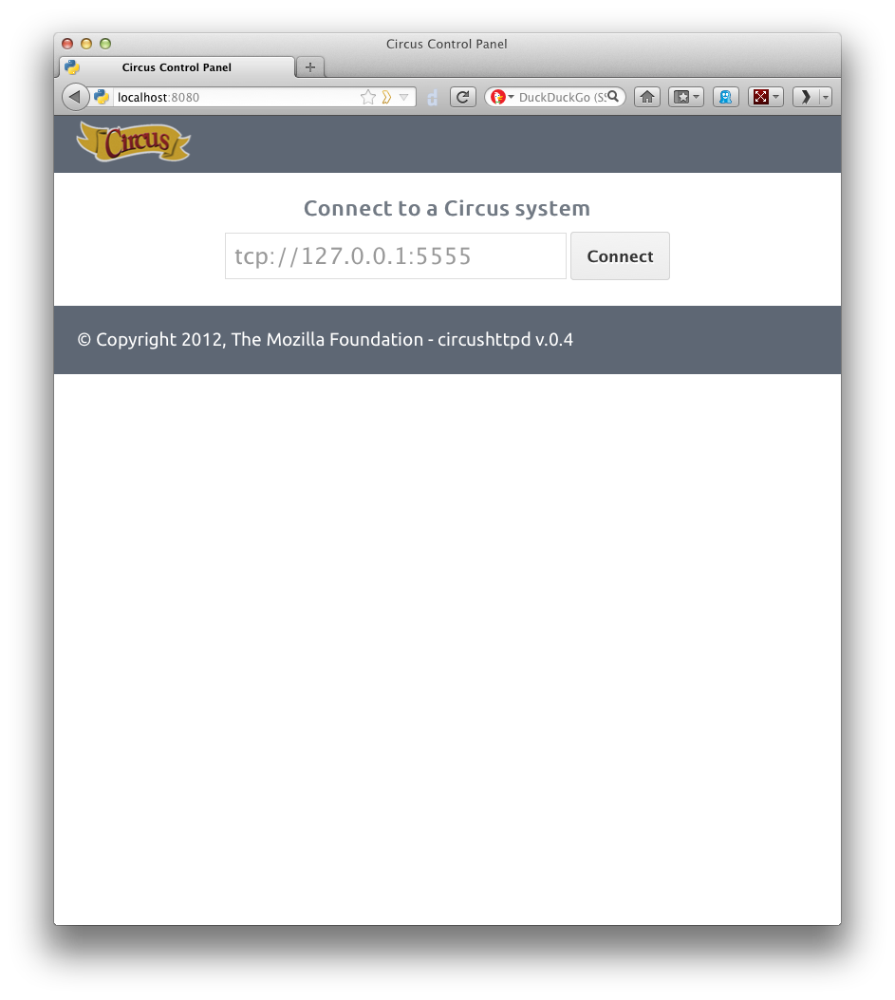
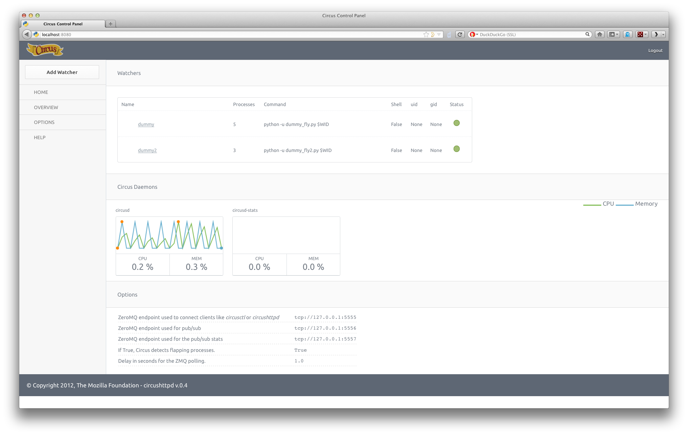
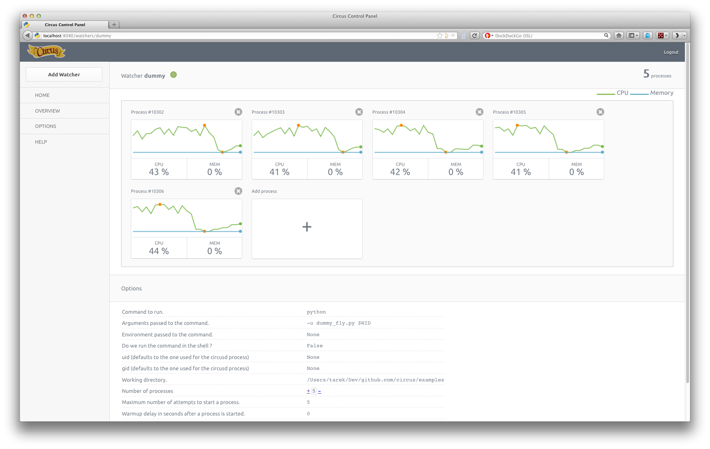
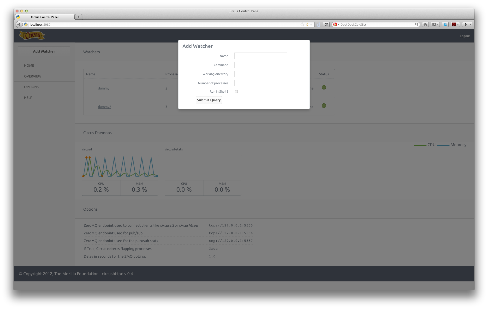

.. _circushttpd:

The Web Console
###############

Circus comes with a Web Console that can be used to manage the system.

The Web Console lets you:

* Connect to any running Circus system
* Watch the processes CPU and Memory usage in real-time
* Add or kill processes
* Add new watchers

.. note::

   The real-time CPU & Memory usage feature uses the stats socket.
   If you want to activate it, make sure the Circus system you'll
   connect to has the stats enpoint enabled in its configuration::

     [circus]
     ...
     stats_endpoint = tcp://127.0.0.1:5557
     ...

   By default, this option is not activated.

The web console is its own package, you need to install::

    $ pip install circus-web

To enable the console, add a few options in the Circus ini file::

    [circus]
    httpd = True
    httpd_host = localhost
    httpd_port = 8080

*httpd_host* and *httpd_port* are optional, and default to *localhost* and *8080*.

If you want to run the web app on its own, just run the **circushttpd** script::

    $ circushttpd
    Bottle server starting up...
    Listening on http://localhost:8080/
    Hit Ctrl-C to quit.

By default the script will run the Web Console on port 8080, but the --port option can
be used to change it.

Using the console
=================

Once the script is running, you can open a browser and visit *http://localhost:8080*.
You should get this screen:

The Web Console is ready to be connected to a Circus system, given its **endpoint**.
By default the endpoint is *tcp://127.0.0.1:5555*.

Once you hit *Connect*, the web application will connect to the Circus system.

With the Web Console logged in, you should get a list of watchers, and a real-time
status of the two Circus processes (circusd and circusd-stats).

You can click on the status of each watcher to toggle it from **Active** (green)
to **Inactive** (red). This change is effective immediatly and let you start & stop
watchers.

If you click on the watcher name, you will get a web page for that particular
watcher, with its processes:

On this screen, you can add or remove processes, and kill existing ones.

Last but not least, you can add a brand new watcher by clicking on the *Add Watcher* link
in the left menu:

Embedding circushttpd into Circus
=================================

*circushttpd* is a WSGI application so you can run it with any web server that's
compatible with that protocol. By default it uses the standard library
**wsgiref** server, but that server does not really support any load.

You can use `Chaussette <http://chaussette.readthedocs.org>`_ to bind a WSGI
server and have *circushttpd* managed by Circus itself.

To do so, make sure Chaussette & the socketio backend are installed::

    $ pip install chaussette
    $ pip install gevent-socketio

Then add a new *watcher* and a *socket* sections in your ini file::

    [watcher:webconsole]
    cmd = chaussette --backend socketio --fd $(circus.sockets.webconsole) circus.web.circushttpd.app
    singleton = 1
    use_sockets = 1

    [socket:webconsole]
    host = 127.0.0.1
    port = 8080

That's it !

Running behind Nginx and Varnish
================================

Nginx can act as a proxy in front of Circus. It an also deal with security.

To hook Nginx, you define a *location* directive that proxies the calls
to Circus.

Example::

    location ~/media/*(.jpg|.css|.js)$ {
        alias /path/to/circus/web/;
    }

    location / {
        proxy_set_header X-Forwarded-For $proxy_add_x_forwarded_for;
        proxy_set_header Host $http_host;
        proxy_redirect off;
        proxy_pass http://127.0.0.1:8080;
    }

If you want more configuration options, see http://wiki.nginx.org/HttpProxyModule.

Websockets in Nginx (v1.2.5) is currently unsupported, although it will be
implemented in 1.3. To receive real-time statuses and graphs in the web console,
you need to use a websocket-compatible proxy like Varnish or HAProxy. In Varnish,
two backends can be defined: one for serving the web console and one for the
handling the socket connections.

Example::

    backend default {
        .host = "127.0.0.1";
        .port = "8001";
    }

    backend socket {
        .host = "127.0.0.1";
        .port = "8080";
        .connect_timeout = 1s;
        .first_byte_timeout = 2s;
        .between_bytes_timeout = 60s;
    }

    sub vcl_pipe {
         if (req.http.upgrade) {
             set bereq.http.upgrade = req.http.upgrade;
         }
    }

    sub vcl_recv {
        if (req.http.Upgrade ~ "(?i)websocket") {
            set req.backend = socket;
          return (pipe);
        }
    }

Here, web console requests are bound to port 8001, and Nginx should be configured to
listen on that port. Websocket connections are upgraded and piped directly to the
circushttpd process listening on port 8080.

Running behind Nginx >= 1.3.13
==============================

As of `Nginx>=1.3.13 <http://nginx.com/news/nginx-websockets.html>`_
websockets are supported by the web server. With Nginx>=1.3.13 there is no
longer a need to reroute websocket traffic via Varnish or HAProxy.

On Ubuntu you can install Nginx>=1.3.13 from Chris Lea's development branch
`PPA <https://launchpad.net/~chris-lea/+archive/nginx-devel>`_, as so:

.. code-block:: sh

   sudo apt-get install python-software-properties
   sudo add-apt-repository ppa:chris-lea/nginx-devel
   sudo apt-get update
   sudo apt-get install nginx
   nginx -v

An example Nginx config with websocket support:

.. code-block:: ini

   # /etc/nginx/sites-enabled/default

   upstream circusweb_server {
     server localhost:8080;
   }

   server {
    listen   80;
    server_name  _;

    location / {
      proxy_pass http://circusweb_server;
      proxy_http_version 1.1;
      proxy_set_header Upgrade $http_upgrade;
      proxy_set_header Connection "upgrade";
      proxy_set_header Host $host;
      proxy_set_header X-Real-IP $remote_addr;
      proxy_set_header X-Forwarded-For $proxy_add_x_forwarded_for;
      proxy_set_header X-Forwarded-Proto http;
      proxy_redirect off;
     }

    location ~/media/\*(.png|.jpg|.css|.js|.ico)$ {
      alias /path_to_site-packages/circusweb/media/;
     }
   }

Password-protect circushttpd
============================

As explained in the :ref:`Security` page, running *circushttpd* is pretty
unsafe. We don't provide any security in Circus itself, but you can protect
your console at the NGinx level, by using http://wiki.nginx.org/HttpAuthBasicModule

Example::

    location / {
        proxy_set_header X-Forwarded-For $proxy_add_x_forwarded_for;
        proxy_set_header Host $http_host;
        proxy_redirect off;
        proxy_pass http://127.0.0.1:8080;
        auth_basic            "Restricted";
        auth_basic_user_file  /path/to/htpasswd;
    }

The **htpasswd** file contains users and their passwords, and a password
prompt will pop when you access the console.

You can use Apache's htpasswd script to edit it, or the Python script they
provide at: http://trac.edgewall.org/browser/trunk/contrib/htpasswd.py

Of course that's just one way to protect your web console, you could use
many other techniques.

Extending the web console
=========================

We picked *bottle* to build the webconsole, mainly because it's a really
tiny framework that doesn't do much. By having a look at the code of the web
console, you'll eventually find out that it's really simple to understand.

Here is how it's split:

* The `circushttpd.py` file contains the "views" definitions and some code to
  handle the socket connection (via socketio).
* the `controller.py` contains a single class which is in charge of doing the
  communication with the circus controller. It allows to have a nicer high
  level API when defining the web server.

If you want to add a feature in the web console you can reuse the code that's
existing. A few tools are at your disposal to ease the process:

* There is a `render_template` function, which takes the named arguments you
  pass to it and pass them to the template renderer and return the resulting
  HTML. It also passes some additional variables, such as the session, the
  circus version and the client if defined.
* If you want to run commands and doa redirection depending the result of it,
  you can use the `run_command` function, which takes a callable as a first
  argument, a message in case of success and a redirection url.

The :class:`StatsNamespace` class is responsible for managing
the websocket communication on the server side. Its documentation should help
you to understand what it does.

