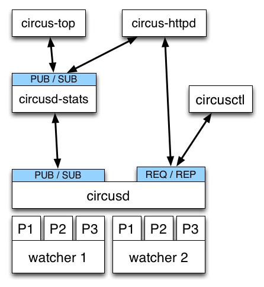

.. _design:

Overall architecture
####################

Circus is composed of a main process called **circusd** which takes
care of running all the processes. Each process managed by Circus
is a child process of **circusd**.

Processes are organized in groups called **watchers**. A
**watcher** is basically a command **circusd** runs on your system,
and for each command you can configure how many processes you
want to run.

The concept of *watcher* is useful when you want to manage all the
processes running the same command -- like restart them, etc.

**circusd** binds two ZeroMQ sockets:

- **REQ/REP** -- a socket used to control **circusd** using json-based
  *commands*.
- **PUB/SUB** -- a socket where **circusd** publishes events, like
  when a process is started or stopped.

.. note::

   Despite its name, ZeroMQ is not a queue management system. Think of it
   as an inter-process communication (IPC) library.

Another process called **circusd-stats** is run by **circusd** when
the option is activated. **circusd-stats**'s job is to publish
CPU/Memory usage statistics in a dedicated **PUB/SUB** channel.

This specialized channel is used by **circus-top** and
**circus-httpd** to display a live stream of the activity.

**circus-top** is a console script that mimics **top** to display
all the CPU and Memory usage of the processes managed by Circus.

**circus-httpd** is the web managment interface that will let you
interact with Circus. It displays a live stream using web sockets
and the **circusd-stats** channel, but also let you interact with
**circusd** via its **REQ/REP** channel.

Last but not least, **circusctl** is a command-line tool that let
you drive **circusd** via its **REQ/REP** channel.

You can also have plugins that subscribe to **circusd**'s **PUB/SUB**
channel and let you send commands to the **REQ/REP** channel like
**circusctl** would.
