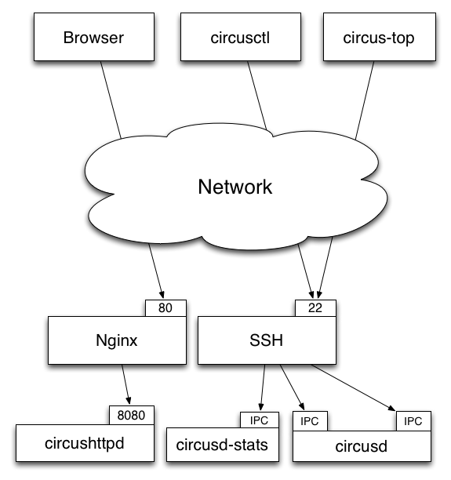

.. _security:

Security
########

Circus is built on the top of the ZeroMQ library and comes with no security
at all in its protocols. However, you can run a Circus system on
a server and set up an SSH tunnel to access it from another machine.

This section explains what Circus does on your system when you run it, and
ends up describing how to use an SSH tunnel.

You can also read http://www.zeromq.org/area:faq#toc5

TCP ports
=========

By default, Circus opens the following TCP ports on the local host:

- **5555** -- the port used to control circus via **circusctl**
- **5556** -- the port used for the Publisher/Subscriber channel.
- **5557** -- the port used for the statistics channel -- if activated.
- **8080** -- the port used by the Web UI -- if activated.

These ports allow client apps to interact with your Circus system, and
depending on how your infrastructure is organized, you may want to protect
these ports via firewalls **or** configure Circus to run using **IPC**
ports.

Here's an example of running Circus using only IPC entry points::

    [circus]
    check_delay = 5
    endpoint = ipc:///var/circus/endpoint
    pubsub_endpoint = ipc:///var/circus/pubsub
    stats_endpoint = ipc:///var/circus/stats

When Configured using IPC, the commands must be run from the same
box, but no one can access them from outside, unlike using TCP. The
commands must also be run as a user that has write access to the
ipc socket paths. You can modify the owner of the **endpoint** using
the **endpoint_owner** config option. This allows you to run circusd
as the root user, but allow non-root processes to send commands to
**circusd**. Note that when using **endpoint_owner**, in order to
prevent non-root processes from being able to start arbitrary
processes that run with greater privileges, the add command will
enforce that new Watchers must run as the **endpoint_owner** user.
Watcher definitions in the local config files will not be restricted
this way.

Of course, if you activate the Web UI, the **8080** port will still
be open.

circushttpd
===========

When you run **circushttpd** manually, or when you use the **httpd**
option in the ini file like this::

    [circus]
    check_delay = 5
    endpoint = ipc:///var/circus/endpoint
    pubsub_endpoint = ipc:///var/circus/pubsub
    stats_endpoint = ipc:///var/circus/stats
    httpd = 1

The web application will run on port *8080* and will let anyone
accessing the web page manage the **circusd** daemon.

That includes creating new watchers that can run any command
on your system !

**Do not make it publicly available**

If you want to protect the access to the web panel, you can serve it
behind Nginx or Apache or any proxy-capable web server, that can
take care of the security.

User and Group Permissions
==========================

By default, all processes started with Circus will be running with the
same user and group as **circusd**. Depending on the privileges the user
has on the system, you may not have access to all the features Circus
provides.

For instance, some statistics features on a running processes require
extended privileges. Typically, if the CPU usage numbers you get using
the **stats** command are *N/A*, it means your user can't access the proc
files. This will be the case by default under Mac OS X.

You may run **circusd** as root to fix this, and set the **uid** and **gid**
values for each watcher to get all the features.

But beware that running **circusd** as root exposes you to potential
privilege escalation bugs. While we're doing our best to avoid any bugs,
running as root and facing a bug that performs unwanted actions on your
system may be dangerous.

The best way to prevent this is to make sure that the system running
Circus is completely isolated (like a VM) **or** to run the whole system
under a controlled user.

SSH tunneling
=============

Clients can connect to a **circusd** instance by creating an SSH tunnel.  To
do so, pass the command line option **--ssh** followed by **user@address**,
where **user** is the user on the remote server and **address** is the
server's address as seen by the client.  The SSH protocol will require
credentials to complete the login.

If **circusd** as seen by the SSH server is not at the default endpoint
address **localhost:5555** then specify the **circusd** address using the
option **--endpoint**

Secured setup example
=====================

Setting up a secured Circus server can be done by:

- Running an SSH Server
- Running Apache or Nginx on the *80* port, and doing a
  reverse-proxy on the *8080* port.
- Blocking the *8080* port from outside access.
- Running all ZMQ Circusd ports using IPC files instead of TCP ports, and
  tunneling all calls via SSH.

