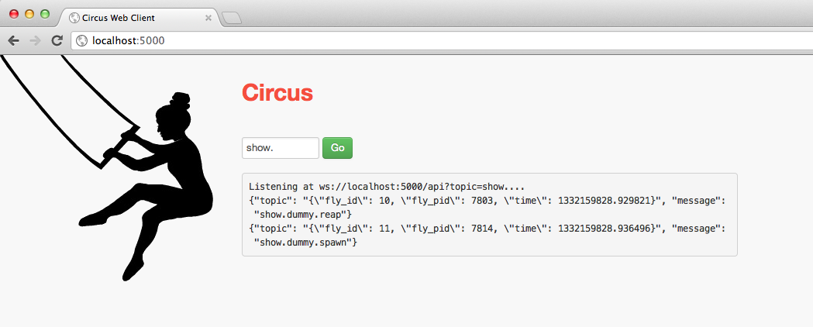

.. _examples:

Examples
########

The **examples** directory in the Circus repository contains a
few examples to get you started.

Open a shell and cd into it::

    $ cd examples

Now try to run the :file:`example1.ini` config::

    $ circusd example1.ini
    2012-03-19 13:29:48 [7843] [INFO] Starting master on pid 7843
    2012-03-19 13:29:48 [7843] [INFO] running dummy process [pid 7844]
    2012-03-19 13:29:48 [7843] [INFO] running dummy process [pid 7845]
    2012-03-19 13:29:48 [7843] [INFO] running dummy process [pid 7846]
    2012-03-19 13:29:48 [7843] [INFO] running dummy process [pid 7847]
    2012-03-19 13:29:48 [7843] [INFO] running dummy process [pid 7848]
    2012-03-19 13:29:48 [7843] [INFO] running dummy2 process [pid 7849]
    2012-03-19 13:29:48 [7843] [INFO] running dummy2 process [pid 7850]
    2012-03-19 13:29:48 [7843] [INFO] running dummy2 process [pid 7851]

Congrats, you have 8 workers running !

Now run in a separate shell the listener script::

    $ python listener.py

This script will print out all events happening in Circus. Try
for instance to kill a worker::

    $ kill 7849

You should see a few lines popping into the listener shell.

If you are brave enough, you can try the web socket demo with a
web socket compatible browser. It will stream every event into
the web page.

