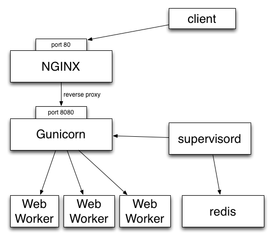
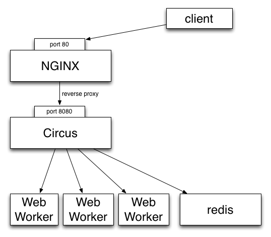

.. class:: center

    **Gestionnaire de Processus & Sockets**

    Tarek Ziadé - tarek@ziade.og - @tarek_ziade

----

Gestion de processus ?
======================

- démarrer/stopper des process
- monitoring / stats
- relancer automatiquement

Exemple -- stack Pyramid:

- 1 process Gunicorn avec 4 workers Pyramid
- 1 process Redis
- 1 process Solr

----

Use case Mozilla
================

**Token Server** - server de generation de clefs

- travail d'encryption => CPU-bound
- 175 process par machine, bcp de machines :)
- Respawn, flapping
- Interface Web avec stats temps reels
- Redirections Stdout/stderr
- Command-line pour controle fin

----

Outils existants
================

- **Supervisord** -- Python, bien, APIs: XML-RPC, bonne communaute,
  dur a etendre, UI web pas terrible, pas de stdout temps reel.

- **Bluepill** -- Gestion du flapping, DSL pénible, moins mature

- **upstart** -- niveau systeme - **doit** etre root

- **daemontools** low level comme upstart, pas d'interaction

- god, monit, runit, etc..

----

Features manquantes
===================

- stdout/stderr temps reel
- stats en temps reel
- Interface Web aussi puissante que la command line
- remote
- clustering
- scalability

=> creation de Circus !

----

Choix techniques
================

- Gestion des process : **psutil**
- Message passing : **ZeroMQ**
- Appli Web : **socket.io** & **Bottle** & **Gevent**
- Le reste: Pure Python

----

psutil
======

- portable (Circus pas encore)
- lenteurs fixees (> 0.6.1)
- API propre et simple

::

   >>> import psutil
   >>> p = psutil.Process(7384)
   >>> p.name
   'Address Book'
   >>> p.create_time
   1346710439.681407
   >>> p.uids
   user(real=501, effective=501, saved=501)

----

ZeroMQ
======

- librairie asynchrone de messages == socket "intelligente"
- highly scalable
- transports: ITC, IPC, TCP, PGM (multicast)
- patterns principaux

 - request/reply
 - pub/sub
 - push/pull

- utilise par IPython
- PyZMQ = bind zmq + I/O event loop adaptee de Tornado

----

Commandes
=========

- **circusd** - daemon principal
- **circus-top** - commande top-like
- **circusctl** - command-line

Lance par **circusd** ou manuellement:

- **circusd-stats** - daemon de stats
- **circus-plugin** - process plugin
- **circushttpd** - interface web

----

Exemple
=======

::

    [circus]
    httpd = 1
    stats_endpoint = tcp://localhost:5557

    [watcher:pyramid]
    cmd = bin/pserve development.ini
    singleton = 1
    working_directory = /var/myapp

    [watcher:redis]
    cmd = /usr/local/bin/redis-server /usr/local/etc/redis.conf
    singleton = 1

    [watcher:retools-workers]
    cmd = /var/myapp/bin/retools-worker main
    numprocesses = 5

Lancement::

  $ circusd webapp.ini

----

Architecture de Circus
======================

.. image:: ../docs/source/images/circus-architecture.png

----

Va mon fils, deploie tes applis
===============================

==> demo \\o/

----

**Mozilla use Case #2 - Gerer les stacks web completes**

----

**Pb. Stack actuelles** *2 niveaux de gestions de process...*

----

**Solution** *En gerant les sockets dans Circus*

----

Les sockets Circus
==================

Comme Apache ou Gunicorn - **modele pre-fork**:

- Chaque process lance par Circus est un child de **circusd**
- **circusd** cree les sockets et les ouvrent
- Les process enfant peuvent accepter des connections sur ces sockets
- Load balancing fait par l'OS

----

Cas concret: WSGI avec Chaussette
=================================

- **Chaussette** : Serveur WSGI pour socket deja ouverte
- Lancement avec le file descriptor de la socket
- Socket reinstancie avec *socket.fromfd()*
- plusieurs backends: gevent, meinheld, waitress, wsgiref, eventlet

http://chaussette.readthedocs.org

----

Exemple::

    [circus]
    ...

    [watcher:web]
    cmd = chaussette --fd $(circus.sockets.web) --backend meinheld mycool.app
    use_sockets = True
    numprocesses = 5

    [socket:web]
    host = 0.0.0.0
    port = 8000

----

**Demo #2 : Une stack web**

----

Benchmarks
==========

Du plus rapide au moins rapide:

- Circus + fastgevent
- Circus + gevent
- Circus + meinheld
- Gunicorn + gevent
- Circus + waitress

c.f. http://tinyurl.com/cykvgmo

----

Features en cours de conception
===============================

- Clustering
- Tunnelling SSH
- Streaming stderr/stdout dans l'appli web
- ...

----

Thanks !
========

Questions ?

- Docs: http://circus.io
- IRC: #mozilla-circus sur Freenode
- ML : http://tech.groups.yahoo.com/group/circus-dev/

