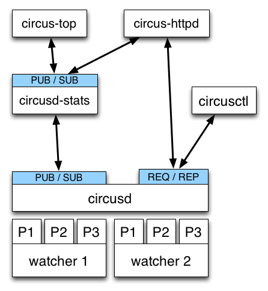

.. image:: ../docs/source/images/circus-medium.png

.. class:: center

    **Gestionnaire de Processus & Sockets**

    Tarek Ziadé - tarek@ziade.org

----

Gestion de processus ?
======================

- démarrer/stopper des process
- monitoring / stats
- relancer automatiquement

Exemple -- stack Pyramid:

- 1 process Gunicorn avec 4 workers Pyramid
- 1 process Redis
- 1 process Solr

----

Use case Mozilla
================

Gerer un cluster d'encryption (= projet TokenServer)

- 175 process par machine, bcp de machines :)
- Respawn, flapping
- Interface Web avec stats temps reels
- Redirections Stdout/stderr
- Command line pour controle fin

----

Outils existants
================

- **Supervisord** -- Python, bien, APIs: XML-RPC, bonne communaute,
  dur a etendre, UI web pas terrible, pas de stdout temps reel.

- **Bluepill** -- Gestion du flapping, DSL pénible, moins mature

- **upstart** -- niveau systeme - **doit** etre root

- **daemontools** low level comme upstart, pas d'interaction

- god, monit, runit, etc..

----

Features manquantes
===================

- stdout/stderr temps reel
- stats en temps reel
- Interface Web aussi puissante que la command line
- remote
- clustering
- scalability

=> creation de Circus !

----

Choix techniques
================

- Gestion des process : **psutil**
- Message passing : **ZeroMQ**
- Appli Web : **Socket.io** & **Bottle** & **Gevent**
- Le reste: Pure Python

----

Architecture de Circus
======================

----

Exemple
=======

webapp.ini::

    [circus]
    check_delay = 5

    [watcher:pyramid]
    cmd = bin/pserve development.ini
    singleton = 1
    working_directory = /var/myapp

    [watcher:redis]
    cmd = /usr/local/bin/redis-server /usr/local/etc/redis.conf
    singleton = 1

    [watcher:retools-workers]
    cmd = /var/myapp/bin/retools-worker main
    numprocesses = 5

Lancement::

  $ circusd webapp.ini

----

Va mon fils, deploie tes applis
===============================

.. image:: devops.jpg

==> demo \\o/

----

**Probleme** *Comment eviter 2 niveaux de gestions de process*

.. image:: ../docs/source/images/classical-stack.png

----

**Solution** *En gerant les sockets dans Circus*

----

Les sockets
===========

Comme Apache ou Gunicorn - **modele pre-fork**:

- Chaque process lance par Circus est un child de **circusd**
- **circusd** cree les sockets et les ouvrent
- Les process enfant peuvent accepter des connections sur ces sockets
- Load balancing fait par l'OS

----

Cas concret: WSGI avec Chaussette
=================================

- **Chaussette** : Serveur WSGI pour socket deja ouverte
- Lancement avec le file descriptor de la socket
- Socket reinstancie avec *socket.fromfd()*
- plusieurs backends: gevent, meinheld, waitress, wsgiref, eventlet

----

Exemple::

    [circus]
    ...

    [watcher:web]
    cmd = chaussette --fd $(circus.sockets.web) --backend meinheld mycool.app
    use_sockets = True
    numprocesses = 5

    [socket:web]
    host = 0.0.0.0
    port = 8000

----

Benchmarks
==========

Du plus rapide au moins rapide:

- Circus + fastgevent
- Circus + gevent
- Circus + meinheld
- Gunicorn + gevent
- Circus + waitress

c.f. http://tinyurl.com/cykvgmo

----

Features en cours de conception
===============================

- Clustering
- XXXX

----

Conclusion
==========

XXXX
